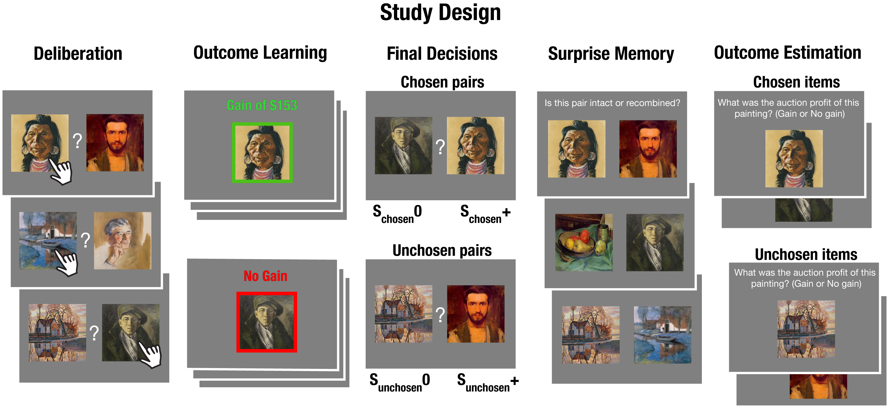
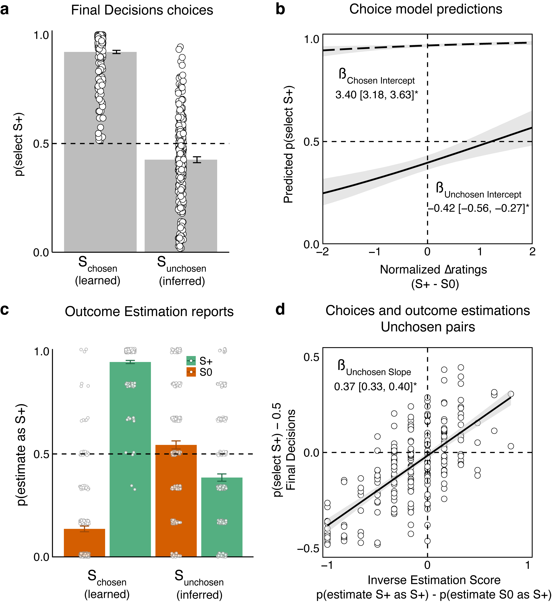

This is an analysis code for a study that assesses the inference of value for unchosen options, given the learned outcomes of chosen options (see design below).
The code loads preprocessed data from five MTurk experiments, and analyses their results. 
Our analysis includes Bayesian regression models, some of which take several hours to run. Accordingly, here we only load the models which we already ran, but if you wish to run the models, you may define the parameter run_models to be equal to 1. 

 

```{css echo=FALSE}
/* Define a margin before h2 and h3 elements */
h2, h3, h4  {
  margin-top: 2em;
}

``` 

## Setup and load data

```{r setup, echo=T, results='hide', message=FALSE, warning=FALSE}

rm(list=ls(all=TRUE)) 

knitr::opts_chunk$set(echo = TRUE, message=FALSE, warning=FALSE)

# If packages are not installed, install. Then, load libraries. 
list_of_packages <- c("ggplot2", "Rmisc", "cowplot", "reshape2", "gridExtra", "arm", "mosaic", "stringr", "tidyr", "dplyr", "bayesplot", "rstanarm", "latex2exp", "kableExtra")
new_packages <- list_of_packages[!(list_of_packages %in% installed.packages()[,"Package"])]
if(length(new_packages)) install.packages(new_packages)
lapply(list_of_packages, require, character.only = TRUE)

# Load functions
source("Functions/plotting.R")
source("Functions/modelling.R")

# Figure parameters
fig_size = c(10,10)
fig_type = "png"  # "eps" # or png
Save_plots <- 1

# Bayesian model params
options(mc.cores = parallel::detectCores())
params <- list()
params$iterations <- 4000
params$chains <- 6
params$warmup <- 2000
params$adapt_delta <- 0.99

# Do you want to run the models or load them?
run_models = 0;

# Load data 
load("../data/Clean_data_lists/clean_data_Pilot.RData")
load("../data/Clean_data_lists/clean_data_Exp1.RData")
load("../data/Clean_data_lists/clean_data_Exp2.RData")
load("../data/Clean_data_lists/clean_data_Exp3.RData")
load("../data/Clean_data_lists/clean_data_Exp4.RData")

bind_experiments <- function(phase_types, exps){
  all_dfs_list <- list()
  for (p in 1:length(phase_types)){
    data <- c()
    for (i in 1:length(exps)){
      curr_data <- eval(parse(text = sprintf("clean_data_%s$%s",exps[i],phase_types[p])))
      data <- bind_rows(data,curr_data)
    }
    all_dfs_list[[p]] <- data
  }
  names(all_dfs_list) <- phase_types
  return(all_dfs_list)
}

phase_types <- names(clean_data_Exp1)
all_exps_list <- bind_experiments(phase_types, c("Pilot", "Exp1", "Exp2", "Exp3", "Exp4"))
n_exps <- length(unique(all_exps_list$final_decisions$Exp))

```

## Demographics 

```{r, participants}

# age and gender
demographics <- all_exps_list$demographics %>%
  group_by(Exp) %>%
  dplyr::summarise(n = n(),
                   mean_age = mean(age, na.rm=1),
                   sd_age = sd(age, na.rm=1),
                   n_females = sum(gender=="Female"),
                   n_males = sum(gender=="Male"),
                   n_other = sum(gender=="Other")) %>%
  mutate(age = sprintf("%.2f \u00b1 %.2f", mean_age, sd_age),
         gender = sprintf("%.0f females, %.0f males, %.0f other", n_females, n_males, n_other)) %>%
  dplyr::select(Exp, age, gender)

# outliers
outliers <- all_exps_list$all_data %>% 
  group_by(Exp) %>%
  dplyr::summarize(n_all = length(unique(PID)),
                   n = length(unique(PID[is_outlier==0]))) %>%
  mutate(outliers = n_all - n) %>%
  dplyr::select(Exp, n, outliers)

# bonus earned
bonus <- all_exps_list$all_data %>%
  group_by(Exp, PID) %>%
  dplyr::summarise(total_bonus = sum(total_reward_tally, na.rm=1),
                   deliberation_bonus = sum(deliberation_reward_tally, na.rm=1)) %>%
  group_by(Exp) %>%
  dplyr::summarise(total_bonus_mean = mean(total_bonus),
                   total_bonus_se = sd(total_bonus),
                   `deliberation bonus` = mean(deliberation_bonus)) %>%
  mutate(`total bonus` = sprintf("%.2f \u00b1 %.2f", total_bonus_mean, total_bonus_se)) %>%
  dplyr::select(Exp, `total bonus`, `deliberation bonus`)

# bind all details
demographics_total <- join(join(demographics, outliers, by="Exp"), bonus, by="Exp") %>%
  mutate(Exp = case_when(Exp=="Pilot" ~ "Pilot",
                         Exp=="Exp1" ~ "Experiment 1",
                         Exp=="Exp2" ~ "Experiment 2",
                         Exp=="Exp3" ~ "Experiment 3",
                         Exp=="Exp4" ~ "Experiment 4")) %>%
  mutate(Exp = factor(Exp, levels = c("Pilot", "Experiment 1", "Experiment 2", "Experiment 3", "Experiment 4"))) %>%
  arrange(Exp) 

demographics_total %>% 
  kbl(caption = "Demographic information") %>%
  kable_paper("hover", full_width = F, html_font = "Helvetica", position = "left")

```

## Analysis of Experiment 1

### Final Decisions phase 
  
Here we present the tendency to select a rewarded item in the Final Decisions phase as a function of pair type (chosen vs. unchosen pairs). We then present the coefficients of a multilevel Bayesian logistic regression estimating the tendency to select a rewarded item as a function of choice type (chosen_trial_centered) and the difference in normalized liking ratings between rewarded and unrewarded items (norm_drate_by_outcome).  


```{r, analysis of final decisions}

# ================================
# Choices in Final Decisions phase 
# ================================

# compute mean probabiltiy to choose gain - for chosen and unchosen alone
p_gain <- clean_data_Exp1$final_decisions %>% 
  mutate(choice = ifelse(chosen_trial==1, "Chosen", "Unchosen")) %>%
  group_by(PID, choice) %>% 
  dplyr::summarize(p_gain = mean(higher_outcome_chosen, na.rm=1)) 

p_gain_group <- p_gain %>%
  group_by(choice) %>%
  dplyr::summarize(mean = mean(p_gain, na.rm=1), se = sd(p_gain, na.rm=1)/sqrt(n())) %>%
  mutate(`p(select rewarded)` = sprintf("%.2f \u00b1 %.2f", mean, se)) %>%
  dplyr::select(choice, `p(select rewarded)`)

# print table of group means and 1 sem
p_gain_group %>%
  kbl() %>%
  kable_paper("hover", full_width = F, html_font = "Helvetica", position = "left")

# ======================================
# Model choices as a function of ratings  
# ======================================

if (run_models==1){
  # run model and use function to rearrange the coefficients
  M_Exp1_choice_ratings <- run_choice_ratings_model(subset(clean_data_Exp1$final_decisions, !is.na(left_chosen)),c(),params,"Exp1")
  coef_list_Exp1 <- create_choice_ratings_coef_list(M_Exp1_choice_ratings, "Exp1", "Pairs")
} else {
  load("../data/Models/Choice_Ratings_models/Coef_lists/coef_list_Exp1.RData")
}

coefs <- coef_list_Exp1$summary_group_coefs %>%
    mutate(sig = ifelse((Median>0 & low95HDI>0 & high95HDI>0) | 
                          (Median<0 & low95HDI<0 & high95HDI<0),"*",""),
           value = sprintf("%.2f [%.2f, %.2f]%s",Median, low95HDI, high95HDI, sig)) %>%
    dplyr::select(coef, value) 

# print table of coefs
coefs %>%
  kbl() %>%
  kable_paper("hover", full_width = F, html_font = "Helvetica", position = "left")

```
  
### Outcome Estimation phase

Here we present the tendency to estimate items as rewarded ones as a fucntion of choice (chosen vs. unchosen items) and actual given reward (rewarded vs. unrewarded, for unchosen items, this is the outcome of their chosen counterpart).  

```{r, analysis of outcome estimation}

# =======================================
# Estimations in Outcome Estimation phase 
# =======================================

outcome_estimation <- clean_data_Exp1$outcome_evaluation %>%
  mutate(choice = ifelse(chosen_obj==1, "Chosen", "Unchosen"),
         reward = ifelse(reward_type==1, "Rewarded", "Unrewarded")) %>% 
  group_by(PID, choice, reward) %>%
  dplyr::summarise(gain_eval = mean(outcome_eval_gain, na.rm=1),
                   eval_acc = mean(outcome_eval_acc, na.rm=1),
                   eval_rt = mean(outcome_eval_rt, na.rm=1))

outcome_est_group <- outcome_estimation %>%
  group_by(choice, reward) %>%
  dplyr::summarise(mean = mean(gain_eval, na.rm=1),
                   se = sd(gain_eval, na.rm=1)/sqrt(n())) %>%
  mutate(`p(estimate as rewarded)` = sprintf("%.2f \u00b1 %.2f",mean, se)) %>%
  dplyr::select(choice,reward,`p(estimate as rewarded)` )

# print table
outcome_est_group %>%
  kbl() %>%
  kable_paper("hover", full_width = F, html_font = "Helvetica", position = "left")

# ===============================================
# Model estimations as a function of outcome type 
# ===============================================

if (run_models==1){
  clean_data_Exp1$outcome_evaluation <- mutate(clean_data_Exp1$outcome_evaluation,
                                             chosen_obj_centered = ifelse(chosen_obj==0,-1,1))
  M_outcome_estimation <- stan_glmer(data = clean_data_Exp1$outcome_evaluation, 
                                     outcome_eval_gain ~ chosen_obj_centered * reward_type + 
                                       (chosen_obj_centered * reward_type | PID),
                                     family = binomial(link="logit"), 
                                     adapt_delta = params$adapt_delta, 
                                     iter = params$iterations, 
                                     chains = params$chains, 
                                     warmup = params$warmup)
  save(M_outcome_estimation, file = "../data/Models/Outcome_estimation/M_outcome_estimation.RData")
} else {
  load("../data/Models/Outcome_estimation/M_outcome_estimation.RData")
}

# Rearrange model coefficients to get coefficients of interest
model_posterior <- as.data.frame(M_outcome_estimation)
outcome_est_group_fits <- model_posterior[,!str_detect(colnames(model_posterior),"PID")] %>%
  mutate(gain_chosen = `(Intercept)` + chosen_obj_centered + reward_type + `chosen_obj_centered:reward_type`,
         no_gain_chosen = `(Intercept)` + chosen_obj_centered - reward_type - `chosen_obj_centered:reward_type`,
         gain_unchosen = `(Intercept)` - chosen_obj_centered + reward_type - `chosen_obj_centered:reward_type`,
         no_gain_unchosen = `(Intercept)` - chosen_obj_centered - reward_type + `chosen_obj_centered:reward_type`) %>%
  gather(coef,value) %>%
  group_by(coef) %>%
  dplyr::summarize(HDI95_low = posterior_interval(as.matrix(value), prob=0.95)[1],
                   HDI95_high = posterior_interval(as.matrix(value), prob=0.95)[2],
                   median = median(value)) %>%
  mutate(value = sprintf("%.2f [%.2f, %.2f]",median, HDI95_low, HDI95_high)) %>%
  dplyr::select(coef, value)

outcome_est_group_fits %>%
  kbl() %>%
  kable_paper("hover", full_width = F, html_font = "Helvetica", position = "left")

```
  
### Figure 2

```{r, figure 2}

linesize <- 0.75
pointsize <- 4
pointstroke <- 0.55
n_sem <- 1 # how many standard errors do we want the error bars to include?

# =================================
# Panel a: means for p(choose gain) 
# =================================

bias <- clean_data_Exp1$final_decisions %>%
  group_by(PID, chosen_trial) %>%
  dplyr::summarize(p_gain = mean(higher_outcome_chosen, na.rm=1), condition=NaN)

p1 <- ggplot(bias, aes(x=factor(chosen_trial),y=p_gain)) +
  stat_summary_bin(aes(y=p_gain), fun.y="mean", geom="bar", binwidth=0.2, 
                   position=position_dodge(width=1), fill="grey") +
  geom_point(aes(color=factor(condition)), position=position_jitterdodge(dodge.width=1, jitter.width=0.1), 
                   fill="white", shape=21, stroke=pointstroke, size=pointsize) +
  scale_color_manual(values="black") + 
  stat_summary(fun.data=mean_se, fun.args = list(mult=n_sem), geom="errorbar", width=0.1, size=0.9, 
               position=position_nudge(0.2), color="black") + # "turquoise4"
  geom_hline(yintercept=0.5, size=linesize, linetype="dashed") + 
  scale_y_continuous(expand=c(0,0), breaks=c(0,0.5,1), limits=c(0,1.05)) + 
  theme + 
  theme(axis.title.x=element_blank(), 
        legend.position="none" , 
        aspect.ratio=2.5/2,
        plot.title = element_text(margin=margin(0,0,30,0))) +
  labs(y="p(select S+)", title="Final Decisions Choices") +
  scale_x_discrete(breaks = c("1","0"), limits=c("1","0"),
                   # labels = c("1" = expression(atop(S[chosen],paste("(learned)"))),
                   #            "0" = expression(atop(S[unchosen],paste("(inferred)"))))) 
                   labels = c("1" = expression(S[chosen]*" (learned)"),
                              "0" = expression(S[unchosen]*" (inferred)"))) 

# ==========================
# Panel b: choice model fits 
# ==========================

# we create 100 fake x values (delta ratings), and for each we will predict the y values of every draw from the posterior distributions. We do that for every condition (chosen vs. unchosen pairs) seperately using their rearranged coefs (e.g., the chosen intercept and chosen slope)
n <- 100 # number x values
fake_x <- seq(-2,2,length.out=n)
predicted_group_draws_list <- list()
for (c in 1:ncol(coef_list_Exp1$coefs_signs)){ # go over each condition (e.g., chosen and unchosen pairs)
  pred_fake <- as.data.frame(matrix(0,nrow=nrow(coef_list_Exp1$posterior_group_coefs),ncol=n))
  for (x in 1:n){ # run over each x observation
    # find the relevant column of the intercept and slope terms for the current condition 
    intercept_col <- which(grepl(paste0("Intercept_",colnames(coef_list_Exp1$coefs_signs)[c]),
                                 colnames(coef_list_Exp1$posterior_group_coefs)))
    slope_col <- which(grepl(paste0("Slope_",colnames(coef_list_Exp1$coefs_signs)[c]),
                             colnames(coef_list_Exp1$posterior_group_coefs)))
    # predict the probability for a gain response for each posterior iteration in current x value 
    pred_fake[,x] <- invlogit(coef_list_Exp1$posterior_group_coefs[,intercept_col] +
                                coef_list_Exp1$posterior_group_coefs[,slope_col]*fake_x[x])
  }
  predicted_group_draws_list[[c]] <- pred_fake
  names(predicted_group_draws_list)[c] <- colnames(coef_list_Exp1$coefs_signs)[c]
}

# now we can compute the median and 95% HDI for every x value 
predicted_group_summary_list <- list()
df_x <- data.frame(obs = 1:n, x = fake_x) 
for (c in 1:ncol(coef_list_Exp1$coefs_signs)){
df_pred <- predicted_group_draws_list[[c]] %>% 
  setNames(seq_len(ncol(.))) %>% 
  tibble::rownames_to_column("posterior_sample") %>% 
  tidyr::gather_("obs", "fitted", setdiff(names(.), "posterior_sample")) %>%
  group_by(obs) %>% 
  dplyr::summarise(median = median(fitted),
                   lower = quantile(fitted, 0.025), 
                   upper = quantile(fitted, 0.975)) %>%
  mutate(obs = as.numeric(obs)) %>%
  left_join(df_x, by="obs") %>% arrange(obs)
predicted_group_summary_list[[c]] <- df_pred
names(predicted_group_summary_list)[c] <- names(predicted_group_draws_list)[c]
}

# line fits
predicted_draws <- data.frame(predicted_group_summary_list$Chosen_Pairs) %>% 
  mutate(choice = "Chosen pairs") %>%
  rbind(mutate(data.frame(predicted_group_summary_list$Unchosen_Pairs),
               choice = "Unchosen pairs")) 

# model text
choice_model_text <- subset(coef_list_Exp1$summary_group_coefs, 
                            grepl("Intercept_",coef) | grepl("Slope_",coef)) %>%
  separate(coef, c("coef","choice","condition"), "_") %>%
  mutate(sig = ifelse((Median>0 & low95HDI>0 & high95HDI>0) | (Median<0 & low95HDI<0 & high95HDI<0),"*",""),
         median = sprintf("%.2f%s",Median, sig),
         text = sprintf("\u03b2(%s %s):\n%.2f [%.2f, %.2f]%s",choice, coef, Median, low95HDI, high95HDI, sig)) %>%
  mutate(x = ifelse(choice=="Chosen", -0.5, 0.5),
         y = ifelse(choice=="Chosen", 0.8, 0.2))

# plot fit

p2 <- ggplot(predicted_draws, aes(y=median,x=x,group=choice)) +
  geom_ribbon(aes(ymin=lower, ymax=upper), fill="#E9E9E9") + 
  geom_line(aes(y=median, linetype=choice), colour="black", size=linesize*1.5) +  
  geom_hline(yintercept=0.5, size=linesize, linetype="dashed") + 
  geom_vline(xintercept=0, size=linesize, linetype="dashed") +
  scale_y_continuous(expand=c(0,0), breaks=c(0,0.5,1), limits=c(0,1.025)) + 
  scale_x_continuous(expand=c(0,0)) +
  scale_linetype_manual(values=c("longdash", "solid")) +
  theme + point_plot_theme + 
  theme(legend.position="none",
        plot.title = element_text(margin=margin(0,0,30,0))) + 
  geom_text(subset(choice_model_text, coef=="Intercept"), 
                   mapping=aes(x=x, y=y, group=choice, label=text), size=7) +
  labs(y="Predicted p(select S+)", 
       x="Normalized \u0394ratings (S+ - S0)",
       title="Choice model predictions") 

# =================================
# Panel c: Outcome estimation means
# =================================

estimates <- outcome_estimation %>%
  mutate(reward = ifelse(reward=="Rewarded", "S+", "S-"))

p3 <- ggplot(estimates, aes(y = gain_eval, x = choice)) +
  stat_summary_bin(aes(y=gain_eval, fill=reward), fun.y="mean", geom="bar", binwidth=0.2,
                   position=position_dodge(width=1)) +
  stat_summary(aes(color=reward, x=choice), 
               fun.data=mean_se, fun.args = list(mult=1), 
               geom="errorbar", width=0.2, size=0.9, position=position_dodge(width=1)) + 
  # geom_beeswarm(aes(color=reward, x=choice), dodge.width=1, fill = "white", size=0.5,priority='descending') +
  # geom_point(aes(color=reward, x=choice), position=position_jitterdodge(dodge.width=1, jitter.width=0.1, jitter.height=0.01),
  #            shape=21, stroke=pointstroke, size=2, fill="white", alpha=0.5) +
  geom_hline(yintercept=0.5, linetype="dashed", size=linesize) + 
  scale_y_continuous(expand=c(0,0), breaks=c(0,0.5,1), limits=c(-0.01,1.05)) + 
  theme + 
  labs(y="p(estimate as S+)", title="Outcome Estimation") +
  theme(
    legend.position = c(.82, .95),
    legend.justification = c("right", "top"),
    legend.box.just = "right",
    legend.margin = margin(6, 6, 6, 6),
    legend.text=element_text(size=18),
    axis.title.x=element_blank(), 
    aspect.ratio=2.2/2,
    plot.title = element_text(margin=margin(0,0,30,0))) +
  scale_color_manual(values=c("#B34E00", "#36875F")) + 
  scale_fill_manual(values=c("#D55E00","#54B082")) + 
  scale_x_discrete(breaks = c("Chosen", "Unchosen"),
                   labels = c(expression(S[chosen]), expression(S[unchosen]))) 

p <- plot_grid(p1,p2,p3, 
               ncol=3, 
               axis="bt", 
               align="v", 
               labels=c("a","b","c"), 
               label_size = 30, 
               label_fontfamily = "Helvetica")
   
if (Save_plots == 1) {ggsave(filename=sprintf("../results/Plots/%s.%s","Figure2",fig_type), 
                             plot=p, 
                             width=fig_size[1]+11,
                             height=fig_size[2]-3)}

```

 

### Relationship between associative memory and inverse bias
  
Here we present regression models assessing the relationship between inverse inference of value and associative memory of the deliberation pairs. We analyse these effects both across participants and within participants.  

```{r, memory and inverse bias}

# =============================
# Between participants analysis 
# =============================

# Compute measures of interest
memory_bias <- clean_data_Exp1$final_decisions %>%
  mutate(choice = ifelse(chosen_trial==1, "Chosen", "Unchosen")) %>%
  group_by(PID, choice) %>%
  dplyr::summarize(p_gain = mean(higher_outcome_chosen, na.rm=1),
                   pair_acc = mean(pair_acc, na.rm=1)) %>%
  spread(choice,p_gain) %>%
  mutate(inverse_bias = Chosen - Unchosen)

# Model inverse decision bias and pairs memory
if (run_models==1){
  coefs_pair_acc_bias_Exp1 <- run_bias_memory_model(subset(clean_data_Exp1$final_decisions, !is.na(left_chosen)),
                                                    "pair_acc",c(),params,"Exp1")
  load("../data/Models/Memory_Bias/Between_subs/Model_objects/M_Exp1_memory_bias.RData")
} else {
  load("../data/Models/Memory_Bias/Between_subs/Model_objects/M_Exp1_memory_bias.RData")
  load("../data/Models/Memory_Bias/Between_subs/Coef_lists/coefs_pair_acc_bias_Exp1.RData")
}

# Present model coefs
pairs_acc_model <- as.data.frame(M_Exp1_memory_bias) %>%
  gather(coef, value, `(Intercept)`:sigma) %>%
  group_by(coef) %>%
  dplyr::summarize(HDI95_low = posterior_interval(as.matrix(value), prob=0.95)[1],
                   HDI95_high = posterior_interval(as.matrix(value), prob=0.95)[2],
                   median = median(value)) %>%
  mutate(value = sprintf("%.2f [%.2f, %.2f]",median, HDI95_low, HDI95_high)) %>%
  dplyr::select(coef, value)

print("between-participants analysis")
pairs_acc_model %>%
  kbl() %>%
  kable_paper("hover", full_width = F, html_font = "Helvetica", position = "left")


# =============================
# Within participants analysis 
# =============================

# For every participant, categorize their deliberation pairs into two groups according to outcome estimations
subs <- unique(clean_data_Exp1$deliberation$PID)
deliberation <- c(); memory <- c(); outcome_evaluation <- c()
for (s in subs){
  curr_outcome_eval <- subset(clean_data_Exp1$outcome_evaluation, PID==s)
  curr_final_decisions <- subset(clean_data_Exp1$final_decisions, PID==s)
  curr_deliberation <- subset(clean_data_Exp1$deliberation, PID==s)
  curr_memory <- subset(clean_data_Exp1$memory, PID==s)
  # insert outcome evaluation to the deliberation matrix, and add a measure of whether this is a direct or inverse pair (whether the outcomes of chosen and unchosen items within a pair are estimated to be the same or not)
  for (t in 1:nrow(curr_deliberation)){
      curr_deliberation$gain_eval_chosen[t] <- 
        curr_outcome_eval$outcome_eval_gain[curr_outcome_eval$stimulus_id==curr_deliberation$chosen_obj[t]]
      curr_deliberation$gain_eval_unchosen[t] <- 
        curr_outcome_eval$outcome_eval_gain[curr_outcome_eval$stimulus_id==curr_deliberation$unchosen_obj[t]]
      curr_deliberation$pair_grouping[t] <- 
        ifelse(curr_deliberation$gain_eval_chosen[t]==curr_deliberation$gain_eval_unchosen[t],
               "Direct transfer", 
               "Inverse transfer")
  }
  # use deliberation info to assign memory pairs
  for (t in 1:nrow(curr_memory)){
    curr_memory$pair_type_left[t] <- 
      curr_deliberation$pair_grouping[curr_deliberation$stimulus_left==curr_memory$stimulus_left[t] | 
                                        curr_deliberation$stimulus_right==curr_memory$stimulus_left[t]]
   curr_memory$pair_type_right[t] <- 
     curr_deliberation$pair_grouping[curr_deliberation$stimulus_left==curr_memory$stimulus_right[t] | 
                                       curr_deliberation$stimulus_right==curr_memory$stimulus_right[t]]
    curr_memory$pair_type_cond[t] <- ifelse(curr_memory$pair_type_left[t]!=curr_memory$pair_type_right[t],
                                            "Direct/Inverse",
                                            ifelse(curr_memory$pair_type_left[t]=="Inverse transfer",
                                                   "Inverse transfer",
                                                   "Direct transfer"))
  }
  # bind subjects mats
  outcome_evaluation <- bind_rows(outcome_evaluation,curr_outcome_eval)
  memory <- bind_rows(memory,curr_memory)
  deliberation <- bind_rows(deliberation, curr_deliberation)
}

# Use old trials only because they necessarily include either direct or inverse transfer 
memory_per_deliberation <- subset(memory, old_pair==1) %>%
    mutate(pair_type_centered = ifelse(pair_type_cond=="Inverse transfer", 1, -1))

# Compute memory means for each deliberation group
memory_per_deliberation_subs <- memory_per_deliberation %>%
  group_by(PID, pair_type_cond) %>%
  dplyr::summarise(pair_acc = mean(pair_acc, na.rm=1)) 

memory_per_deliberation_means <- memory_per_deliberation_subs %>%
  group_by(pair_type_cond) %>%
  dplyr::summarize(mean = mean(pair_acc),
                   se = sd(pair_acc)/sqrt(n())) %>%
  mutate(`pair memory accuracy` = sprintf("%.2f \u00b1 %.2f",mean, se)) %>%
  dplyr::rename(`condition type` = pair_type_cond) %>%
  dplyr::select(`condition type`, `pair memory accuracy`)

print("within-participants analysis")

memory_per_deliberation_means %>%
  kbl() %>%
  kable_paper("hover", full_width = F, html_font = "Helvetica", position = "left")

# Model the effect
if (run_models==1){
  M_memory_per_deliberation_Exp1 <- stan_glmer(data = memory_per_deliberation,
                          pair_acc ~ pair_type_centered + (pair_type_centered | PID),
                          family = binomial(link="logit"), 
                          adapt_delta = params$adapt_delta, 
                          iter = params$iterations, 
                          chains = params$chains, 
                          warmup = params$warmup)
  save(M_memory_per_deliberation_Exp1, 
       file = "../data/Models/Memory_Bias/Within_subs/M_memory_per_deliberation_Exp1.RData")
} else {
  load("../data/Models/Memory_Bias/Within_subs/M_memory_per_deliberation_Exp1.RData")
}

# Present model coefs
memory_pair_type_model <- as.data.frame(M_memory_per_deliberation_Exp1) %>%
  gather(coef, value, `(Intercept)`:pair_type_centered) %>%
  group_by(coef) %>%
  dplyr::summarize(HDI95_low = posterior_interval(as.matrix(value), prob=0.95)[1],
                   HDI95_high = posterior_interval(as.matrix(value), prob=0.95)[2],
                   median = median(value)) %>%
  mutate(value = sprintf("%.2f [%.2f, %.2f]",median, HDI95_low, HDI95_high)) %>%
  dplyr::select(coef,value)

memory_pair_type_model %>%
  kbl() %>%
  kable_paper("hover", full_width = F, html_font = "Helvetica", position = "left")

```
  
### Figure 3 - memory and bias
  
```{r, figure 3}

point_size <- 4.5
point_stroke <- 0.6
line_size <- 1

# inverse decision bias as a function of pairs memory
memory_model_text <- coefs_pair_acc_bias_Exp1$posterior_draws_per_cond$no_cond %>%
    gather(coef, value) %>% 
    group_by(coef) %>%
    dplyr::summarize(Median=median(value), 
                     low95=quantile(value, 0.025), 
                     high95=quantile(value, 0.975)) %>%
    mutate(sig = ifelse((Median>0 & low95>0 & high95>0) | (Median<0 & low95<0 & high95<0),"*",""),
           x = 0.25, 
           y = -0.5,
           text = sprintf("\u03b2(Memory):\n%.2f [%.2f, %.2f]%s",Median, low95, high95, sig)) %>%
    subset(coef=="Slope")

p1 <- ggplot(coefs_pair_acc_bias_Exp1$bias_memory_data, aes(y=bias_diff,x=pair_acc)) + 
  geom_point(size=point_size, fill="white", shape=21, stroke=point_stroke) + 
  theme + 
  point_plot_theme +
  geom_ribbon(data = mutate(coefs_pair_acc_bias_Exp1$predicted_summary_list[[1]], bias_diff=median), 
              aes(ymin=lower, ymax=upper), fill="#DFEBE9") + 
  geom_line(aes(y=median), data=coefs_pair_acc_bias_Exp1$predicted_summary_list[[1]], 
            colour="turquoise4", size=line_size*1.5) +  
  geom_hline(yintercept=0, size=line_size, linetype="dashed") + 
  geom_vline(xintercept=0.5, size=line_size,  linetype="dashed") +
  scale_y_continuous(expand=c(0,0),  breaks=c(-1,0,1), limits=c(-1.025,1.025)) + 
  scale_x_continuous(expand=c(0,0), breaks=c(0, 0.5, 1), limits=c(-0.025, 1.025)) +
  theme(legend.position="none", plot.title = element_text(margin=margin(0,0,30,0))) + 
  labs(y=expression(atop("Inverse decision bias","p(select "*S[chosen]*"+) - p(select "*S[unchosen]*"+)")),
       x="Pairs memory (accuracy)",
       title="Between participants") +
  geom_text(data=memory_model_text,  mapping=aes(x=x, y=y, label=text), size=8)

memory_per_deliberation_subs <- mutate(memory_per_deliberation_subs, condition=NaN)

# pairs accuracy per deliberation pair
p2 <- ggplot(memory_per_deliberation_subs, 
             aes(x=pair_type_cond,y=pair_acc)) +
  stat_summary_bin(aes(y=pair_acc), fun.y="mean", geom="bar", binwidth=0.2, 
                   position=position_dodge(width=1), fill="grey") +
  geom_point(aes(color=factor(condition)), position=position_jitterdodge(dodge.width=1, jitter.width=0.1), 
             fill="white", shape=21, stroke=point_stroke, size=point_size) +
  scale_color_manual(values="black") + 
  stat_summary(fun.data=mean_se, fun.args = list(mult=n_sem), geom="errorbar",  width=0.1, size=1, 
               position=position_nudge(0.2), color="turquoise4") + 
  geom_hline(yintercept=0.5, size=line_size, linetype="dashed") + 
  scale_y_continuous(expand=c(0,0),  breaks=c(0,0.5,1), limits=c(0,1.025)) + 
  theme + 
  theme(legend.position="none", 
        aspect.ratio=3/2,
        plot.title = element_text(margin=margin(0,0,30,0))) +
  labs(x = "Type of deliberation pairs", 
       y="Pairs memory (accuracy)", 
       title="Within participants")

p <- plot_grid(p1,p2,
               ncol=2,
               axis="bt",
               align="v", 
               labels=c("a","b"), 
               label_size = 30, 
               label_fontfamily = "Helvetica",
               rel_widths = c(1,0.8))
 
if (Save_plots == 1) {ggsave(filename=sprintf("../results/Plots/%s.%s","Figure3",fig_type), 
                             plot=p, 
                             width=fig_size[1]+7,
                             height=fig_size[2]-1)}

```
  

  

### Figure 4: decision bias and memory correlations across all data sets 
  
```{r, figure 4}

bias_all_exps <- all_exps_list$final_decisions %>%
  mutate(choice = ifelse(chosen_trial==1, "Chosen", "Unchosen")) %>%
  mutate(Exp = factor(Exp, levels = c("Pilot", "Exp1", "Exp2", "Exp3", "Exp4")),
         condition = ifelse(is.na(cond_logical), "None", 
                            ifelse(cond_logical==1, "1", "0"))) %>%
         # condition = ifelse(cond_logical==1 | is.na(cond_logical), "1", "0")) %>%
  group_by(Exp, choice, condition, PID) %>%
  dplyr::summarise(p_gain = mean(higher_outcome_chosen, na.rm=1),
                   pair_acc = mean(pair_acc, na.rm=1)) %>%
  mutate(nudge = ifelse(Exp %in% c("Pilot", "Exp1"), 0.2, 0.125))

bias_all_exps_spread <- bias_all_exps %>%
  spread(choice, p_gain) %>%
  mutate(bias = Chosen - Unchosen) 

# show decision bias for all exps

color1 <- "#3FAFAB"; color2 <- "#DFA214"; color3 <- "black"
fillcolor1 <- "#73D2BC"; fillcolor2 <- "#FFCC33"; fillcolor3 <- "#C1C1C1"

p1 <- ggplot(bias_all_exps, aes(x=choice,y=p_gain,color=condition)) +
  stat_summary_bin(aes(y=p_gain, fill=condition), fun.y="mean", color=NA, 
                   geom="bar", binwidth=0.15, position=position_dodge(width=1)) +
  geom_point(aes(group=condition), position=position_jitterdodge(dodge.width=1, jitter.width=0.1, jitter.height=0), 
                   fill="white", shape=21, stroke=0.4, size=2) +
  scale_color_manual(values=c(color1, color2, color3)) + 
  scale_fill_manual(values=c(fillcolor1, fillcolor2, fillcolor3)) + 
  stat_summary(aes(group=condition, x=as.numeric(as.factor(choice))+nudge), 
               fun.data=mean_se, fun.args = list(mult=n_sem), 
               geom="errorbar", width=0.15, size=0.7, position=position_dodge(width=1)) + 
  geom_hline(yintercept=0.5, size=linesize, linetype="dashed") + 
  scale_y_continuous(expand=c(0,0), breaks=c(0,0.5,1), limits=c(0,1.05)) + 
  theme + 
  theme(legend.position = "none",
        axis.title.x=element_blank(), 
        aspect.ratio=3/2,
        strip.background = element_rect(colour=NA, fill=NA),
        panel.spacing = unit(4, "lines"),
        plot.title = element_text(margin=margin(0,0,30,0), hjust = 0.5, size = 30), 
        text = element_text(size=26,family="Helvetica"),
        axis.title = element_text(size = 24), 
        axis.text = element_text(size = 22, color = "black")) +
  scale_x_discrete(breaks = c("Chosen","Unchosen"), 
                   labels = c("Chosen" = expression(S[chosen]),
                              "Unchosen" = expression(S[unchosen]))) + 
  labs(y="p(select S+)", title="Inverse decision bias") + 
  facet_wrap(.~Exp, 
             ncol=5,
             labeller = labeller(Exp = c(Pilot="Pilot\n", Exp1="Experiment 1\n", Exp2="Experiment 2\n", 
                                         Exp3="Experiment 3\n", Exp4="Experiment 4\n")))

# show memory vs. inverse bias

# load regression coefficients or run the model
if (run_models==1){
  coefs_pair_acc_bias_Pilot <- run_bias_memory_model(subset(clean_data_Pilot$final_decisions, !is.na(left_chosen)),
                                                     "pair_acc",c(),params,"Pilot")
  coefs_pair_acc_bias_Exp1 <- run_bias_memory_model(subset(clean_data_Exp1$final_decisions, !is.na(left_chosen)),
                                                    "pair_acc",c(),params,"Exp1")
  coefs_pair_acc_bias_Exp2 <- run_bias_memory_model(subset(clean_data_Exp2$final_decisions, !is.na(left_chosen)),
                                                    "pair_acc","repeat_cond_centered",params,"Exp2")
  coefs_pair_acc_bias_Exp3 <- run_bias_memory_model(subset(clean_data_Exp3$final_decisions, !is.na(left_chosen)),
                                                    "pair_acc","reward_cond",params,"Exp3")
  coefs_pair_acc_bias_Exp4 <- run_bias_memory_model(subset(clean_data_Exp4$final_decisions,!is.na(left_chosen)),
                                                    "pair_acc","same_painter_centered",params,"Exp4")
} else {
  load("../data/Models/Memory_Bias/Between_subs/Coef_lists/coefs_pair_acc_bias_Pilot.RData")
  load("../data/Models/Memory_Bias/Between_subs/Coef_lists/coefs_pair_acc_bias_Exp1.RData")
  load("../data/Models/Memory_Bias/Between_subs/Coef_lists/coefs_pair_acc_bias_Exp2.RData")
  load("../data/Models/Memory_Bias/Between_subs/Coef_lists/coefs_pair_acc_bias_Exp3.RData")
  load("../data/Models/Memory_Bias/Between_subs/Coef_lists/coefs_pair_acc_bias_Exp4.RData")
}

arrange_predicted_fits <- function(coef_list, Exp_name){
  if (length(colnames(coef_list$predicted_summary_list[[1]]))>5){
    pred_summary <- bind_rows(coef_list$predicted_summary_list[[1]],coef_list$predicted_summary_list[[2]])
    colnames(pred_summary)[5] <- "condition";
  } else {
    pred_summary <- coef_list$predicted_summary_list[[1]]
  }
  pred_summary <- bind_cols(data.frame(Exp=rep(Exp_name,1,nrow(pred_summary))),pred_summary)
  return(pred_summary)
}
memory_predicted_fits <- bind_rows(arrange_predicted_fits(coefs_pair_acc_bias_Pilot, "Pilot"),
                            arrange_predicted_fits(coefs_pair_acc_bias_Exp1, "Exp1"), 
                            arrange_predicted_fits(coefs_pair_acc_bias_Exp2, "Exp2"),
                            arrange_predicted_fits(coefs_pair_acc_bias_Exp3, "Exp3"),
                            arrange_predicted_fits(coefs_pair_acc_bias_Exp4, "Exp4")) %>%
  mutate(condition = ifelse(is.na(condition), "None", ifelse(condition==1, "1", "0")),
         Exp = factor(Exp, levels = c("Pilot", "Exp1", "Exp2", "Exp3", "Exp4")))

arrange_memory_group_fits <- function(coef_list, Exp_name){
  post_draws <- coef_list$posterior_draws 
  if (ncol(post_draws) > 3) { # for Experiments 2-4
    post_draws <- post_draws %>%
      mutate(`1` = post_draws[,2] + post_draws[,4],
             `0` = post_draws[,2] - post_draws[,4],
             Experiment = Exp_name) %>%
      dplyr::select(Experiment,`1`,`0`) %>%
      gather(condition, value, `1`:`0`)
  } else {
    post_draws <- post_draws %>%
      dplyr::rename(None = pair_acc) %>%
      mutate(Experiment = Exp_name) %>%
      dplyr::select(Experiment, None) %>%
      gather(condition, value, None)
  }
  return(post_draws)
}

memory_group_fits_text <- bind_rows(arrange_memory_group_fits(coefs_pair_acc_bias_Pilot, "Pilot"),
                            arrange_memory_group_fits(coefs_pair_acc_bias_Exp1, "Exp1"), 
                            arrange_memory_group_fits(coefs_pair_acc_bias_Exp2, "Exp2"),
                            arrange_memory_group_fits(coefs_pair_acc_bias_Exp3, "Exp3"),
                            arrange_memory_group_fits(coefs_pair_acc_bias_Exp4, "Exp4")) %>%
    group_by(Experiment, condition) %>%
    dplyr::summarize(Median=median(value), low95=quantile(value, 0.025), high95=quantile(value, 0.975)) %>%
    mutate(sig = ifelse((low95>0 & high95>0) | (low95<0 & high95<0),"*",""),
           text = sprintf("%.2f [%.2f, %.2f]%s",Median, low95, high95, sig),
           x = 0.45,
           y = ifelse(condition=="0", -0.5, -0.75)) %>%
  mutate(Exp = factor(Experiment, levels = c("Pilot", "Exp1", "Exp2", "Exp3", "Exp4"))) %>%
  arrange(Exp) 

p2 <- ggplot(bias_all_exps_spread, aes(y=bias, x=pair_acc)) + 
  geom_hline(yintercept=0, size=line_size, linetype="dashed") + 
  geom_vline(xintercept=0.5, size=line_size, linetype="dashed") +
  geom_point(size=point_size-2.5, shape=21, fill="white", stroke=point_stroke, aes(color=condition)) + 
  theme + point_plot_theme +
  geom_ribbon(data = mutate(memory_predicted_fits, bias=median), 
              aes(ymin=lower, ymax=upper, fill=condition)) + 
  geom_line(aes(y=median,color=condition), data=memory_predicted_fits, size=line_size*1.5) +  
  scale_color_manual(values=c(color1, color2, color3)) + 
  scale_fill_manual(values=c(fillcolor1, fillcolor2, fillcolor3)) + 
  scale_y_continuous(expand=c(0,0), breaks=c(-1,0,1), limits=c(-1.025,1.025)) + 
  scale_x_continuous(expand=c(0,0), breaks=c(0, 0.5, 1), limits=c(-0.025, 1.025)) +
  theme(legend.position = "none",
        plot.title = element_text(margin=margin(0,0,30,0), hjust = 0.5, size = 28), 
        text = element_text(size=26,family="Helvetica"),
        axis.title = element_text(size = 24), 
        axis.text = element_text(size = 20, color = "black")) +
  labs(y="Inverse decision bias", 
       x="Pairs memory",
       title="Associative memory and inverse decision bias") +
  geom_text(data=memory_group_fits_text, mapping=aes(x=x, y=y, label=text, color=condition),size=7) + 
  facet_wrap(.~Exp, 
             ncol=5,
             labeller = labeller(Exp = c(Pilot="Pilot\n", Exp1="Experiment 1\n", Exp2="Experiment 2\n", 
                                         Exp3="Experiment 3\n", Exp4="Experiment 4\n")))

p <- plot_grid(p1, p2, 
               nrow=2, 
               axis="bt",
               labels=c("a","b"), 
               label_size = 30,
               label_fontfamily = "Helvetica")

if (Save_plots == 1) {ggsave(filename=sprintf("../results/Plots/%s.%s","Figure4",fig_type), 
                             plot=p, 
                             width=fig_size[1]+10,
                             height=fig_size[2]+2)}

```
  


### Power analysis for Experiment 1 based on Pilot study 

```{r}

library("pwr")
library("lme4")
library("lsr")

# ========================================================
# run simple logistic regressions to predict decision bias
# ========================================================

final_decisions_pilot <- subset(clean_data_Pilot$final_decisions, !is.na(left_chosen)) 

# run logistic fits for each subject and detect their unchosen intercept
subs <- unique(final_decisions_pilot$PID)
subs_coefs <- data.frame()
for (i in 1:length(subs)){
  sub_data <- subset(final_decisions_pilot, PID == subs[i])
  m_sub <- glm(data = sub_data, 
                higher_outcome_chosen ~ chosen_trial_centered * norm_drate_by_outcome, 
                family = binomial(link = "logit"))
  subs_coefs[i,1] <- subs[i]
  subs_coefs[i,c(2:5)] <- m_sub$coefficients
}
colnames(subs_coefs) <- c("PID",rownames(as.data.frame(m_sub$coefficients)))

# compute unchosen intercept (intercept coef - chosen_trial coef)
subs_coefs <- mutate(subs_coefs, unchosen_intercept = `(Intercept)` - chosen_trial_centered)

# compute power
compute_power <- function(desired_power,desired_sig_level,data,coef,null_point){
  t_stats <- data %>%
  dplyr::summarize(
    t_value = as.numeric(t.test(!!sym(coef), rep(null_point, n()), paired=TRUE)["statistic"]),
    p_value = as.numeric(t.test(!!sym(coef), rep(null_point, n()), paired=TRUE)["p.value"]),
    cohens_d = cohensD(x=!!sym(coef),y=rep(null_point, n()),method="paired"), 
    power = as.numeric(pwr.t.test(n = n(), d = cohens_d, sig.level = desired_sig_level, 
                       type = c("paired"))["power"]),
    desired_sample = as.numeric(pwr.t.test(power = desired_power, d = cohens_d, 
                                sig.level = desired_sig_level, type = c("paired"))["n"]))
  return(t_stats)
}
power_pilot <- compute_power(0.99, 0.05, subs_coefs, "unchosen_intercept",0)
colnames(power_pilot) <- c("t value", "p value", "Cohen's d", "power in pilot study", "desired sample to get 99% power")

power_pilot %>%
  kbl() %>%
  kable_paper("hover", full_width = F, html_font = "Helvetica", position = "left")

```
  

## Supplementary Material analyses
  
### Supplementary Text 2
  
#### Supplementary Figure 1


  
#### Tables with data from Experiments 2 to 4

Here we present tabels with behavioral data as well as regression cofficients of several models across all our experiments.  

```{r, supplementary text 2 - tables}

# Show decision bias and memory performance for each experiment 

# ========================
# Means of behavioral data 
# ========================

means_all_exps <- all_exps_list$final_decisions %>% 
  dplyr::rename(Condition = "cond_name") %>%
  mutate(Choice = ifelse(chosen_trial==1, "Chosen", "Unchosen"),
         Exp = case_when(Exp=="Pilot" ~ "Pilot",
                         Exp=="Exp1" ~ "Experiment 1",
                         Exp=="Exp2" ~ "Experiment 2",
                         Exp=="Exp3" ~ "Experiment 3",
                         Exp=="Exp4" ~ "Experiment 4"),
         Condition = ifelse(Condition=="High repetition", "More repetitions", 
                            ifelse(Condition=="Low repetition", "Less repetitions", Condition))) %>%
  mutate(Exp = factor(Exp, levels = c("Pilot", "Experiment 1", "Experiment 2", "Experiment 3", "Experiment 4"))) %>%
  group_by(Exp, PID, Choice, Condition) %>% 
  dplyr::summarize(p_gain = mean(higher_outcome_chosen, na.rm=1),
                   pair_acc = mean(pair_acc, na.rm=1)) 

group_means_all_exps <- means_all_exps %>%
  group_by(Exp, Choice, Condition) %>%
  dplyr::summarize(mean_p_gain = mean(p_gain, na.rm=1), se_p_gain = sd(p_gain, na.rm=1)/sqrt(n()),
                   mean_pair_acc = mean(pair_acc, na.rm=1), se_pair_acc = sd(pair_acc, na.rm=1)/sqrt(n())) %>%
  mutate(p_gain = sprintf("%.2f \u00b1 %.2f",mean_p_gain, se_p_gain),
         pair_acc = sprintf("%.2f \u00b1 %.2f",mean_pair_acc, se_pair_acc)) %>%
  dplyr::select(Exp, Choice, Condition, p_gain, pair_acc) %>%
  spread(Choice, p_gain) %>%
  dplyr::select(Exp, Condition, Chosen, Unchosen, pair_acc) %>%
  dplyr::rename(`S+ selection (Chosen pairs)` = Chosen, `S+ selection (Unchosen pairs)` = Unchosen, `Pairs memory` = pair_acc)

group_means_all_exps %>%
  kbl(caption = "Supplementary Table 1. Behavioral performance in all experiments") %>%
  kable_paper("hover", full_width = F, html_font = "Helvetica", position = "left")

# ========================
# Choice and ratings model
# ========================

if (run_models==1){
  # run models for all experiments (but exp1)
  M_Pilot_choice_ratings <- run_choice_ratings_model(
    subset(clean_data_Pilot$final_decisions, !is.na(left_chosen)),c(),params,"Pilot")
  M_Exp1_choice_ratings <- run_choice_ratings_model(
    subset(clean_data_Exp1$final_decisions, !is.na(left_chosen)),c(),params,"Exp1")
  M_Exp2_choice_ratings <- run_choice_ratings_model(
    subset(clean_data_Exp2$final_decisions, !is.na(left_chosen)),"repeat_cond_centered",params,"Exp2")
  M_Exp3_choice_ratings <- run_choice_ratings_model(
    subset(clean_data_Exp3$final_decisions, !is.na(left_chosen)),"reward_cond",params,"Exp3")
  M_Exp4_choice_ratings <- run_choice_ratings_model(
    subset(clean_data_Exp4$final_decisions, !is.na(left_chosen)),"same_painter_centered",params,"Exp4")
  # create coef list
  coef_list_Pilot <- create_choice_ratings_coef_list(M_Pilot_choice_ratings, "Pilot", "Pairs")
  coef_list_Exp1 <- create_choice_ratings_coef_list(M_Exp1_choice_ratings, "Exp1", "Pairs")
  coef_list_Exp2 <- create_choice_ratings_coef_list(M_Exp2_choice_ratings, "Exp2", c("HighRepeat", "LowRepeat"))
  coef_list_Exp3 <- create_choice_ratings_coef_list(M_Exp3_choice_ratings, "Exp3", c("HighReward", "LowReward"))
  coef_list_Exp4 <- create_choice_ratings_coef_list(M_Exp4_choice_ratings, "Exp4", c("Same", "Diff"))
} else {
  load("../data/Models/Choice_Ratings_models/Coef_lists/coef_list_Pilot.RData")
  load("../data/Models/Choice_Ratings_models/Coef_lists/coef_list_Exp1.RData")
  load("../data/Models/Choice_Ratings_models/Coef_lists/coef_list_Exp2.RData")
  load("../data/Models/Choice_Ratings_models/Coef_lists/coef_list_Exp3.RData")
  load("../data/Models/Choice_Ratings_models/Coef_lists/coef_list_Exp4.RData")
}

# =================================================
# Present choice and ratings model fits: full model
# =================================================

# Concatenate model fits of all experiments 
arrange_fits_full <- function(coef_list, Exp_name){
  coefs <- coef_list$summary_group_coefs
  if(nrow(coefs) > 8){
    coefs <- coefs[c(1:8),]; coefs$coef <- c("Intercept", "Choice", "Condition", "Choice:Condition", "Ratings", 
                                             "Choice:Ratings", "Ratings:Condition", "Choice:Ratings:Condition")
  } else {
    coefs <- coefs[c(1:4),]; coefs$coef <- c("Intercept", "Choice", "Ratings", "Choice:Ratings")
  }
  coefs <- coefs %>%
    mutate(Exp = Exp_name, 
           sig = ifelse((low95HDI>0 & high95HDI>0) | (low95HDI<0 & high95HDI<0),"*",""),
           value = sprintf("%.2f [%.2f %.2f]%s",Median, low95HDI, high95HDI, sig)) %>%
    dplyr::select(Exp, coef, value) %>%
    spread(coef, value) 
  return(coefs)
}

choice_ratings_fits_full <- bind_rows(arrange_fits_full(coef_list_Pilot, "Pilot"),
                                      arrange_fits_full(coef_list_Exp1, "Exp. 1"), 
                                      arrange_fits_full(coef_list_Exp2, "Exp. 2"),
                                      arrange_fits_full(coef_list_Exp3, "Exp. 3"),
                                      arrange_fits_full(coef_list_Exp4, "Exp. 4")) %>%
  dplyr::select(Exp, Intercept, Choice, Ratings, `Choice:Ratings`, Condition, `Choice:Condition`, 
                `Ratings:Condition`, `Choice:Ratings:Condition`)

choice_ratings_fits_full %>%
  kbl(caption = "Supplementary Table 2. Regression coefficients in the Final Decision phase") %>%
  kable_paper("hover", full_width = F, html_font = "Helvetica", position = "left") 

# ===========================================================
# Present choice and ratings model fits: slope and intercepts
# ===========================================================

arrange_fits <- function(coef_list, Exp_name){
  coefs <- subset(coef_list$summary_group_coefs, grepl(c("Intercept_"),coef) | grepl(c("Slope_"),coef)) %>%
    mutate(Exp = Exp_name, 
           sig = ifelse((Median>0 & low95HDI>0 & high95HDI>0) | (Median<0 & low95HDI<0 & high95HDI<0),"*",""),
           value = sprintf("%.2f [%.2f %.2f]%s",Median, low95HDI, high95HDI,sig)) %>%
    dplyr::select(Exp, coef, value) %>%
    separate(coef, c("coef","choice","condition"), "_") %>%
    spread(coef, value) %>%
    dplyr::rename(Choice = "choice", Condition = "condition")
  return(coefs)}

choice_ratings_fits <- bind_rows(arrange_fits(coef_list_Pilot, "Pilot"),
                                 arrange_fits(coef_list_Exp1, "Experiment 1"), 
                                 arrange_fits(coef_list_Exp2, "Experiment 2"),
                                 arrange_fits(coef_list_Exp3, "Experiment 3"),
                                 arrange_fits(coef_list_Exp4, "Experiment 4")) 

slopes <- choice_ratings_fits %>% 
  dplyr::select(Exp, Choice, Condition, Slope) %>% 
  spread(Choice, Slope) %>% 
  dplyr::rename(`Slope (Chosen pairs)` = "Chosen", `Slope (Unchosen pairs)` = "Unchosen")
intercepts <- choice_ratings_fits %>% 
  dplyr::select(Exp, Choice, Condition, Intercept) %>% 
  spread(Choice, Intercept) %>% 
  dplyr::rename(`Intercept (Chosen pairs)` = "Chosen", `Intercept (Unchosen pairs)` = "Unchosen")
fits_table <- merge(intercepts, slopes, by=c("Exp", "Condition")) %>%
  mutate(Condition = case_when(Condition=="HighRepeat" ~ "More repetitions",
                               Condition=="LowRepeat" ~ "Less repetitions",
                               Condition=="HighReward" ~ "High reward",
                               Condition=="LowReward" ~ "Low reward",
                               Condition=="Same" ~ "Same painter",
                               Condition=="Diff" ~ "Different painter",
                               Condition=="Pairs" ~ ""),
        Experiment = factor(Exp, levels=c("Pilot", "Experiment 1", "Experiment 2", "Experiment 3", "Experiment 4"))) %>%
  arrange(Experiment) %>%
  dplyr::select(Experiment, Condition, `Intercept (Chosen pairs)`, `Slope (Chosen pairs)`,
                `Intercept (Unchosen pairs)`, `Slope (Unchosen pairs)`)

fits_table %>%
  kbl(caption = "Supplementary Table 3. Coefficients of interest for chosen and unchosen pairs.") %>%
  kable_paper("hover", full_width = F, html_font = "Helvetica", position = "left") 

# ========================================================
# Present choice and ratings model fits: across conditions
# ========================================================

choice_ratings_fits_across_conds <- function(coef_list, Exp_name){
  coefs <- coef_list$posterior_group_coefs %>%
    mutate(Experiment = Exp_name,
           Chosen_Intercept = `(Intercept)` + chosen_trial_centered,
           Unchosen_Intercept = `(Intercept)` - chosen_trial_centered,
           Chosen_Slope = norm_drate_by_outcome + `chosen_trial_centered:norm_drate_by_outcome`,
           Unchosen_Slope = norm_drate_by_outcome - `chosen_trial_centered:norm_drate_by_outcome`) %>%
    dplyr::select(c(Experiment,Chosen_Intercept,Unchosen_Intercept,Chosen_Slope,Unchosen_Slope)) %>%
    gather(coef, value,Chosen_Intercept:Unchosen_Slope) %>%
    separate(coef, c("choice","coef"), "_") %>%
    group_by(Experiment,choice,coef) %>%
    dplyr::summarise(HDI95_low = posterior_interval(as.matrix(value), prob=0.95)[1],
                     HDI95_high = posterior_interval(as.matrix(value), prob=0.95)[2],
                     median = median(value)) %>%
    mutate(sig = ifelse((median>0 & HDI95_low>0 & HDI95_high>0) | (median<0 & HDI95_low<0 & HDI95_high<0),"*",""),
           value = sprintf("%.2f [%.2f %.2f]%s",median, HDI95_low, HDI95_high,sig)) %>%
    dplyr::select(c(Experiment, choice, coef, value)) %>%
    spread(coef, value) %>%
    dplyr::rename(Choice = "choice")
  return(coefs)
}

fits_across_conds <- bind_rows(choice_ratings_fits_across_conds(coef_list_Exp2, "Experiment 2"),
                               choice_ratings_fits_across_conds(coef_list_Exp3, "Experiment 3"),
                               choice_ratings_fits_across_conds(coef_list_Exp4, "Experiment 4"))

slopes_across_conds <- fits_across_conds %>% 
  dplyr::select(Experiment, Choice, Slope) %>% 
  spread(Choice, Slope) %>% 
  dplyr::rename(`Slope (Chosen pairs)` = "Chosen", `Slope (Unchosen pairs)` = "Unchosen")
intercepts_across_conds <- fits_across_conds %>% 
  dplyr::select(Experiment, Choice, Intercept) %>% 
  spread(Choice, Intercept) %>% 
  dplyr::rename(`Intercept (Chosen pairs)` = "Chosen", `Intercept (Unchosen pairs)` = "Unchosen")
fits_table_across_conds <- merge(intercepts_across_conds, slopes_across_conds, by=c("Experiment")) %>%
  dplyr::select(Experiment, `Intercept (Chosen pairs)`, `Slope (Chosen pairs)`,
                `Intercept (Unchosen pairs)`, `Slope (Unchosen pairs)`)

fits_table_across_conds %>%
  kbl(caption = "Supplementary Table 4. Coefficients of interest for chosen and unchosen pairs across conditions") %>%
  kable_paper("hover", full_width = F, html_font = "Helvetica", position = "left") 

# =====================
# Memory and bias model
# =====================

if (run_models==1){
  coefs_pair_acc_bias_Pilot <- run_bias_memory_model(subset(clean_data_Pilot$final_decisions, !is.na(left_chosen)),
                                                     "pair_acc",c(),params,"Pilot")
  coefs_pair_acc_bias_Exp1 <- run_bias_memory_model(subset(clean_data_Exp1$final_decisions, !is.na(left_chosen)),
                                                    "pair_acc",c(),params,"Exp1")
  coefs_pair_acc_bias_Exp2 <- run_bias_memory_model(subset(clean_data_Exp2$final_decisions, !is.na(left_chosen)),
                                                    "pair_acc","repeat_cond_centered",params,"Exp2")
  coefs_pair_acc_bias_Exp3 <- run_bias_memory_model(subset(clean_data_Exp3$final_decisions, !is.na(left_chosen)),
                                                    "pair_acc","reward_cond",params,"Exp3")
  coefs_pair_acc_bias_Exp4 <- run_bias_memory_model(subset(clean_data_Exp4$final_decisions,!is.na(left_chosen)),
                                                    "pair_acc","same_painter_centered",params,"Exp4")
} else {
  load("../data/Models/Memory_Bias/Between_subs/Coef_lists/coefs_pair_acc_bias_Pilot.RData")
  load("../data/Models/Memory_Bias/Between_subs/Coef_lists/coefs_pair_acc_bias_Exp1.RData")
  load("../data/Models/Memory_Bias/Between_subs/Coef_lists/coefs_pair_acc_bias_Exp2.RData")
  load("../data/Models/Memory_Bias/Between_subs/Coef_lists/coefs_pair_acc_bias_Exp3.RData")
  load("../data/Models/Memory_Bias/Between_subs/Coef_lists/coefs_pair_acc_bias_Exp4.RData")
}

# ===================================
# Present model fits: memory and bias 
# ===================================

memory_fits <- function(coef_list, Exp_name){
  post_draws <- coef_list$posterior_draws 
  if (ncol(post_draws) > 3) {
    post_draws <- post_draws %>%
      mutate(Slope_cond1 = post_draws[,2] + post_draws[,4],
             Slope_cond0 = post_draws[,2] - post_draws[,4])
    colnames <- c("Intercept", "Memory", "Condition", "Memory:Condition", "Sigma", 
                  "Memory (Condition1)", "Memory (Condition2)")
  } else {
    colnames <- c("Intercept", "Memory", "Sigma")
  }
  colnames(post_draws) <- colnames
  summary_draws <- post_draws %>%
    gather(coef, value) %>% 
    group_by(coef) %>%
    dplyr::summarize(Median=median(value), low95=quantile(value, 0.025), high95=quantile(value, 0.975)) %>%
    mutate(sig = ifelse((low95>0 & high95>0) | (low95<0 & high95<0),"*",""),
             value = sprintf("%.2f [%.2f, %.2f]%s",Median, low95, high95, sig),
             Exp = Exp_name) %>%
    dplyr::select(Exp, coef, value) %>%
    spread(coef,value) %>%
    dplyr::select("Exp", colnames, -"Sigma")
  return(summary_draws)
}

pair_acc_fits <- bind_rows(memory_fits(coefs_pair_acc_bias_Pilot, "Pilot"),
                          memory_fits(coefs_pair_acc_bias_Exp1, "Exp1"), 
                          memory_fits(coefs_pair_acc_bias_Exp2, "Exp2"),
                          memory_fits(coefs_pair_acc_bias_Exp3, "Exp3"),
                          memory_fits(coefs_pair_acc_bias_Exp4, "Exp4"))

pair_acc_fits %>%
  kbl(caption = "Supplementary Table 5. Memory and choice model regression coefficients") %>%
  kable_paper("hover", full_width = F, html_font = "Helvetica", position = "left") 

```

#### Analyzing Experiment 2 (low vs. high repetition of deliberation pairs)

```{r, supplementary text 2 - experiment 2}

# ====================================================================
# Memory difference between conditions (to assess memory manipulation)
# ====================================================================

# Run model
if (run_models == 1) {
  memory_Exp2 <- clean_data_Exp2$memory %>%
    mutate(repeat_cond_centered = ifelse(repeat_cond==1,1,-1))
  M_memory_diff_Exp2 <- stan_glmer(data = memory_Exp2, 
                              pair_acc ~ repeat_cond_centered + (repeat_cond_centered | PID),
                              family = binomial(link="logit"), 
                              adapt_delta = params$adapt_delta, 
                              iter = params$iterations, 
                              chains = params$chains, 
                              warmup = params$warmup)
  save(M_memory_diff_Exp2, file = "../data/Models/Supplementary_analyses/Memory_differences/M_memory_diff_Exp2.RData")
} else {
  load("../data/Models/Supplementary_analyses/Memory_differences/M_memory_diff_Exp2.RData")
}

# Present coefs
sims_M_memory_diff_Exp2 <- as.data.frame(M_memory_diff_Exp2)
coef_memory_diff_Exp2 <- sims_M_memory_diff_Exp2[, c("(Intercept)", "repeat_cond_centered")]  %>%
  gather(coef,value) %>%
  group_by(coef) %>%
  dplyr::summarise(HDI95_low = posterior_interval(as.matrix(value), prob=0.95)[1],
                   HDI95_high = posterior_interval(as.matrix(value), prob=0.95)[2],
                   median = median(value)) %>%
  mutate(value = sprintf("%.2f [%.2f, %.2f]",median, HDI95_low, HDI95_high),
         coef = ifelse(coef=="repeat_cond_centered", "condition slope (repeatition type)", coef)) %>%
  dplyr::select(coef,value)

coef_memory_diff_Exp2 %>%
  kbl() %>%
  kable_paper("hover", full_width = F, html_font = "Helvetica", position = "left")

# ===========================================
# Decision bias difference between conditions
# ===========================================

# Choices in Final Decisions phase
conds_diff_Exp2 <- clean_data_Exp2$final_decisions %>%
  mutate(choice = ifelse(chosen_trial==1, "Chosen", "Unchosen")) %>%
  group_by(PID, cond_logical, choice) %>%
  dplyr::summarize(p_gain = mean(higher_outcome_chosen, na.rm=1)) %>%
  spread(cond_logical, p_gain) %>%
  mutate(cond_diff = `0` - `1`) %>%
  group_by(choice) %>%
  dplyr::summarise(mean = mean(cond_diff),
                   se = sd(cond_diff)/sqrt(n())) %>%
  mutate(`p(select S+) difference between conditions`= sprintf("%.2f \u00b1 %.2f",mean, se)) %>%
  dplyr::select(choice, `p(select S+) difference between conditions`)

conds_diff_Exp2 %>%
  kbl() %>%
  kable_paper("hover", full_width = F, html_font = "Helvetica", position = "left")

# Model coefficient (we rearrange the coefs to get the difference score)
unchosen_intercept_diffs_Exp2 <- data.frame(coef=coef_list_Exp2$posterior_group_coefs$Intercept_Unchosen_LowRepeat - 
  coef_list_Exp2$posterior_group_coefs$Intercept_Unchosen_HighRepeat) %>%
  dplyr::summarise(HDI95_low = posterior_interval(as.matrix(coef), prob=0.95)[1],
                   HDI95_high = posterior_interval(as.matrix(coef), prob=0.95)[2],
                   median = median(coef)) %>%
  mutate(`unchosen intercept difference between conditions` = sprintf("%.2f [%.2f, %.2f]",median, HDI95_low, HDI95_high))

unchosen_intercept_diffs_Exp2 %>%
  dplyr::select(`unchosen intercept difference between conditions`) %>%
  kbl() %>%
  kable_paper("hover", full_width = F, html_font = "Helvetica", position = "left")

```

#### Analyzing Experiment 3 (low vs. high reward)

```{r, supplementary text 2 - experiment 3}

# ========================================================================================
# Chosen pairs intercept difference between conditions (to assess motivation manipulation)
# ========================================================================================

chosen_intercept_diffs_Exp3 <- data.frame(coef=coef_list_Exp3$posterior_group_coefs$Intercept_Chosen_HighReward - 
             coef_list_Exp3$posterior_group_coefs$Intercept_Chosen_LowReward) %>%
  dplyr::summarise(HDI95_low = posterior_interval(as.matrix(coef), prob=0.95)[1],
                   HDI95_high = posterior_interval(as.matrix(coef), prob=0.95)[2],
                   median = median(coef)) %>%
  mutate(`chosen intercept difference between conditions` = sprintf("%.2f [%.2f, %.2f]",median, HDI95_low, HDI95_high))

chosen_intercept_diffs_Exp3 %>%
  dplyr::select(`chosen intercept difference between conditions`) %>%
  kbl() %>%
  kable_paper("hover", full_width = F, html_font = "Helvetica", position = "left")

# ===================================================================================
# Memory difference between conditions (to assess whether motivation impacted memory)
# ===================================================================================

memory_Exp3 <- clean_data_Exp3$memory 
if (run_models == 1) {
  M_memory_diff_Exp3 <- stan_glmer(data = memory_Exp3, 
                              pair_acc ~ reward_cond + (reward_cond | PID),
                              family = binomial(link="logit"), 
                              adapt_delta = params$adapt_delta, 
                              iter = params$iterations, 
                              chains = params$chains, 
                              warmup = params$warmup)
save(M_memory_diff_Exp3,
     file = "../data/Models/Supplementary_analyses/Memory_differences/M_memory_diff_Exp3.RData")
} else {
  load("../data/Models/Supplementary_analyses/Memory_differences/M_memory_diff_Exp3.RData")
}

sims_M_memory_diff_Exp3 <- as.data.frame(M_memory_diff_Exp3)
coef_memory_diff_Exp3 <- sims_M_memory_diff_Exp3[, c("(Intercept)", "reward_cond")]  %>%
  gather(coef,value) %>%
  group_by(coef) %>%
  dplyr::summarise(HDI95_low = posterior_interval(as.matrix(value), prob=0.95)[1],
                   HDI95_high = posterior_interval(as.matrix(value), prob=0.95)[2],
                   median = median(value)) %>%
  mutate(value = sprintf("%.2f [%.2f, %.2f]",median, HDI95_low, HDI95_high),
         coef = ifelse(coef=="reward_cond", "condition slope (reward type)", coef)) %>%
  dplyr::select(coef, value)

coef_memory_diff_Exp3 %>%
  kbl() %>%
  kable_paper("hover", full_width = F, html_font = "Helvetica", position = "left")


# ===========================================
# Decision bias difference between conditions
# ===========================================

# Choices in Final Decisions phase
conds_diff_Exp3 <- clean_data_Exp3$final_decisions %>%
  mutate(choice = ifelse(chosen_trial==1, "Chosen", "Unchosen")) %>%
  group_by(PID, cond_logical, choice) %>%
  dplyr::summarize(p_gain = mean(higher_outcome_chosen, na.rm=1)) %>%
  spread(cond_logical, p_gain) %>%
  mutate(cond_diff = `0` - `1`) %>%
  group_by(choice) %>%
  dplyr::summarise(mean = mean(cond_diff),
                   se = sd(cond_diff)/sqrt(n())) %>%
  mutate(`p(select S+) difference between conditions`= sprintf("%.2f \u00b1 %.2f",mean, se)) %>%
  dplyr::select(choice, `p(select S+) difference between conditions`)

conds_diff_Exp3 %>%
  kbl() %>%
  kable_paper("hover", full_width = F, html_font = "Helvetica", position = "left")

# Model coefficient (we rearrange the coefs to get the difference score)

unchosen_intercept_diffs_Exp3 <- data.frame(coef=coef_list_Exp3$posterior_group_coefs$Intercept_Unchosen_LowReward - 
             coef_list_Exp3$posterior_group_coefs$Intercept_Unchosen_HighReward) %>%
  dplyr::summarise(HDI95_low = posterior_interval(as.matrix(coef), prob=0.95)[1],
                   HDI95_high = posterior_interval(as.matrix(coef), prob=0.95)[2],
                   median = median(coef)) %>%
  mutate(`unchosen intercept difference between conditions` = sprintf("%.2f [%.2f, %.2f]",median, HDI95_low, HDI95_high))

unchosen_intercept_diffs_Exp3 %>%
  dplyr::select(`unchosen intercept difference between conditions`) %>%
  kbl() %>%
  kable_paper("hover", full_width = F, html_font = "Helvetica", position = "left")

```

#### Analyzing Experiment 4 (same vs. different painter)

```{r, supplementary text 2 - experiment 4}

# =============================================================================================
# Memory difference between conditions (to assess whether binding manipulation impacted memory)
# =============================================================================================

# Run model
if (run_models == 1) {
  memory_Exp4 <- clean_data_Exp4$memory %>%
  mutate(painter_centered = ifelse(del_same_painter==1,1,-1))
  M_memory_diff_Exp4 <- stan_glmer(data = memory_Exp4, 
                              pair_acc ~ painter_centered + (painter_centered | PID),
                              family = binomial(link="logit"), 
                              adapt_delta = params$adapt_delta, 
                              iter = params$iterations, 
                              chains = params$chains, 
                              warmup = params$warmup)
save(M_memory_diff_Exp4,
     file = "../data/Models/Supplementary_analyses/Memory_differences/M_memory_diff_Exp4.RData")
} else {
  load("../data/Models/Supplementary_analyses/Memory_differences/M_memory_diff_Exp4.RData")
}

# Present model coefs
sims_M_memory_diff_Exp4 <- as.data.frame(M_memory_diff_Exp4)
coef_memory_diff_Exp4 <- 
  sims_M_memory_diff_Exp4[, c("(Intercept)", "painter_centered")]  %>%
  gather(coef,value) %>%
  group_by(coef) %>%
  dplyr::summarise(HDI95_low = posterior_interval(as.matrix(value), prob=0.95)[1],
                   HDI95_high = posterior_interval(as.matrix(value), prob=0.95)[2],
                   median = median(value)) %>%
  mutate(value = sprintf("%.2f [%.2f, %.2f]",median, HDI95_low, HDI95_high),
         coef = ifelse(coef=="painter_centered", "condition slope (painter type)", coef)) %>%
  dplyr::select(coef,value)

coef_memory_diff_Exp4 %>%
  kbl() %>%
  kable_paper("hover", full_width = F, html_font = "Helvetica", position = "left")

# ================================================================================================
# Difference in memory slope in Memory - Bias model (condition modulated memory-bias relationship)
# ================================================================================================

memory_bias_diff_conds_Exp4 <- 
  data.frame(coef=coefs_pair_acc_bias_Exp4$posterior_draws_per_cond$cond1$Slope - 
             coefs_pair_acc_bias_Exp4$posterior_draws_per_cond$cond0$Slope) %>%
  dplyr::summarise(HDI95_low = posterior_interval(as.matrix(coef), prob=0.95)[1],
                   HDI95_high = posterior_interval(as.matrix(coef), prob=0.95)[2],
                   median = median(coef)) %>%
  mutate(`memory slope difference between conditions` = sprintf("%.2f [%.2f, %.2f]",median, HDI95_low, HDI95_high))

memory_bias_diff_conds_Exp4 %>%
  dplyr::select(`memory slope difference between conditions`) %>%
  kbl() %>%
  kable_paper("hover", full_width = F, html_font = "Helvetica", position = "left")


# ===========================================
# Decision bias difference between conditions
# ===========================================

# Choices in Final Decisions phase
conds_diff_Exp4 <- clean_data_Exp4$final_decisions %>%
  mutate(choice = ifelse(chosen_trial==1, "Chosen", "Unchosen")) %>%
  group_by(PID, cond_logical, choice) %>%
  dplyr::summarize(p_gain = mean(higher_outcome_chosen, na.rm=1)) %>%
  spread(cond_logical, p_gain) %>%
  mutate(cond_diff = `0` - `1`) %>%
  group_by(choice) %>%
  dplyr::summarise(mean = mean(cond_diff),
                   se = sd(cond_diff)/sqrt(n())) %>%
  mutate(`p(select S+) difference between conditions`= sprintf("%.2f \u00b1 %.2f",mean, se)) %>%
  dplyr::select(choice, `p(select S+) difference between conditions`)

conds_diff_Exp4 %>%
  kbl() %>%
  kable_paper("hover", full_width = F, html_font = "Helvetica", position = "left")

# Model coefficient
unchosen_intercept_diffs_Exp4 <- 
  data.frame(coef=coef_list_Exp4$posterior_group_coefs$Intercept_Unchosen_Diff - 
               coef_list_Exp4$posterior_group_coefs$Intercept_Unchosen_Same) %>%
  dplyr::summarise(HDI95_low = posterior_interval(as.matrix(coef), prob=0.95)[1],
                   HDI95_high = posterior_interval(as.matrix(coef), prob=0.95)[2],
                   median = median(coef)) %>%
  mutate(`unchosen intercept difference between conditions` = sprintf("%.2f [%.2f, %.2f]",median, HDI95_low, HDI95_high))

unchosen_intercept_diffs_Exp4 %>%
  dplyr::select(`unchosen intercept difference between conditions`) %>%
  kbl() %>%
  kable_paper("hover", full_width = F, html_font = "Helvetica", position = "left")

```

### Supplemetaty Text 3: Analysis of ratings change 

```{r, supplementary text 3}

# ===============
# Behavioral data 
# ===============

# Merge data from three experiments
final_ratings <- all_exps_list$final_ratings %>%
  mutate(choice = ifelse(chosen_obj==1, "Schosen", "Sunchosen"),
         reward = ifelse(reward_type==1, "S+", "S0"),
         cond_logical = ifelse(repeat_cond==1 & Exp=="Exp2" | reward_cond==1 & Exp=="Exp3", 1, 0),
         norm_rating_diff_per_test = normalized_new_rating - normalized_initial_rating,
         Exp = case_when(Exp=="Exp1" ~ "Experiment 1",
                         Exp=="Exp2" ~ "Experiment 2",
                         Exp=="Exp3" ~ "Experiment 3"))

# Summarize mean rating difference for each participant by condition (choice & reward)
preference_change_means <- subset(final_ratings, deliberated_stim==1) %>%
  group_by(Exp, PID, choice, reward) %>%
  dplyr::summarize(diff_ratings = mean(diff_norm_rating, na.rm=1)) 

# ================
# Model the effect
# ================

if (run_models==1){
  # run models for all experiments 
  M_Exp1_preference_change <- run_preference_change_model(
    subset(clean_data_Exp1$final_ratings, deliberated_stim==1) %>%
      mutate(chosen_obj_centered = ifelse(chosen_obj==1,1,-1)), 
    c(),params,"Exp1")
  M_Exp2_preference_change <- run_preference_change_model(
    clean_data_Exp2$final_ratings %>% 
      subset(deliberated_stim==1) %>%
      mutate(repeat_cond_centered = ifelse(repeat_cond==1, 1, -1),
             chosen_obj_centered = ifelse(chosen_obj==1,1,-1)),
    "repeat_cond_centered",params,"Exp2")
  M_Exp3_preference_change <- run_preference_change_model(
    subset(clean_data_Exp3$final_ratings, deliberated_stim==1) %>%
      mutate(chosen_obj_centered = ifelse(chosen_obj==1,1,-1)),
    "reward_cond",params,"Exp3")
} else {
  load("../data/Models/Supplementary_analyses/Preference_change/M_Exp1_preference_change.RData")
  load("../data/Models/Supplementary_analyses/Preference_change/M_Exp2_preference_change.RData")
  load("../data/Models/Supplementary_analyses/Preference_change/M_Exp3_preference_change.RData")
}

# ===============================================================
# Compute model coefficients per each condition (reward x choice)
# ===============================================================

# Model coefficients
rearrange_coefs_preference_change <- function(model_object, Exp_name){
  model_posterior <- as.data.frame(model_object)
  coefs_ratings <- model_posterior[,!str_detect(colnames(model_posterior),"PID")] %>%
    mutate(chosen_rewarded = `(Intercept)` + reward_type + chosen_obj_centered + `reward_type:chosen_obj_centered`,
           chosen_unrewarded = `(Intercept)` - reward_type + chosen_obj_centered - `reward_type:chosen_obj_centered`,
           unchosen_rewarded = `(Intercept)` + reward_type - chosen_obj_centered - `reward_type:chosen_obj_centered`,
           unchosen_unrewarded = `(Intercept)` - reward_type - chosen_obj_centered + `reward_type:chosen_obj_centered`,
           chosen_diff_reward = chosen_rewarded - chosen_unrewarded,
           unchosen_diff_reward = unchosen_rewarded - unchosen_unrewarded) %>%
    gather(coef,value) %>%
    group_by(coef) %>%
    dplyr::summarize(HDI95_low = posterior_interval(as.matrix(value), prob=0.95)[1],
                     HDI95_high = posterior_interval(as.matrix(value), prob=0.95)[2],
                     median = median(value)) %>%
    mutate(sig = ifelse((HDI95_low>0 & HDI95_high>0) | (HDI95_low<0 & HDI95_high<0),"*",""),
           text = sprintf("%.2f [%.2f, %.2f]%s",median, HDI95_low, HDI95_high, sig),
           Exp = Exp_name)
    
  return(coefs_ratings)
}

coefs_preference_change <- bind_rows(rearrange_coefs_preference_change(M_Exp1_preference_change, "Experiment 1"),
                                     rearrange_coefs_preference_change(M_Exp2_preference_change, "Experiment 2"),
                                     rearrange_coefs_preference_change(M_Exp3_preference_change, "Experiment 3")) %>%
  subset(coef %in% c("chosen_rewarded", "chosen_unrewarded", "unchosen_rewarded", "unchosen_unrewarded", "chosen_diff_reward", "unchosen_diff_reward"))

# ================================================
# Create a table with means and model coefficients
# ================================================

# Behavioral means
preference_change_means_table <- preference_change_means %>%
  spread(reward, diff_ratings) %>%
  mutate(`S+ - S0` = `S+` - S0) %>%
  gather(Reward, value, `S+`:`S+ - S0`) %>%
  group_by(Exp, choice, Reward) %>%
  dplyr::summarise(mean = mean(value, na.rm=1),
                   se = sd(value, na.rm=1)/sqrt(n())) %>%
  mutate(text = sprintf("%.2f \u00b1 %.2f",mean, se)) %>%
  dplyr::select(-c(mean, se)) %>%
  spread(choice, text) %>%
  dplyr::rename(`Schosen (behavior)` = Schosen, `Sunchosen (behavior)` = Sunchosen)

preference_change_coefs_table <- coefs_preference_change %>%
  mutate(choice = ifelse(str_detect(coef,"unchosen"), "Sunchosen (coefs)", "Schosen (coefs)"),
         Reward = ifelse(str_detect(coef,"diff"), "S+ - S0",
                              ifelse(str_detect(coef,"unrewarded"), "S0", "S+"))) %>%
  dplyr::select(Exp, choice, Reward, text) %>%
  spread(choice, text)

preference_change_table <- merge(preference_change_means_table, preference_change_coefs_table, by=c("Exp", "Reward")) %>%
  mutate(Reward = factor(Reward, levels=c("S+","S0", "S+ - S0"))) %>%
  arrange(Exp, Reward)

preference_change_table %>%
  kbl(caption = "Supplementary Table 6. Ratings change effects in Experiments 1 to 3") %>%
  kable_paper("hover", full_width = F, html_font = "Helvetica", position = "left")

```

#### Supplementary Figure 2

```{r, supp figure 2}

p <- ggplot(preference_change_means, aes(y = diff_ratings, x = choice)) +
  stat_summary_bin(aes(y=diff_ratings, fill=reward), fun.y="mean", geom="bar", binwidth=0.2,
                   position=position_dodge(width=1)) +
  geom_point(aes(color=reward), position=position_jitterdodge(dodge.width=1, jitter.width=0.1), 
             fill="white", shape=21, stroke=0.5, size=1) +
  stat_summary(aes(group=reward, color=reward, x=as.numeric(as.factor(choice))+0.13), 
               fun.data=mean_se, fun.args = list(mult=1), 
               geom="errorbar", width=0.2, size=0.9, position=position_dodge(width=1)) + 
  geom_hline(yintercept=0, size=1) + 
  theme + 
  labs(y="Difference in normalaized ratings\n(final - initial)", title="Changes in subjective ratings") + 
  theme(
    legend.position = c(.228, .95),
    legend.justification = c("right", "top"),
    legend.box.just = "right",
    legend.direction = "horizontal",
    legend.margin = margin(6, 6, 6, 6),
    legend.text=element_text(size=16),
    axis.title.x=element_blank(), 
    aspect.ratio=5/3,
    plot.title = element_text(margin=margin(0,0,30,0), hjust = 0.5, size = 22, face = "plain"),
    strip.background = element_blank(),
    strip.text.x = element_text(size = 20)) +
    scale_color_manual(values=c("#36875F", "#B34E00")) + 
  scale_fill_manual(values=c("#54B082", "#D55E00")) + 
  facet_wrap(.~Exp)

if (Save_plots==1) {ggsave(filename=sprintf("../results/Plots/%s.%s","Supp_Figure2",fig_type), 
       plot=p, 
       width=fig_size[1]+2,
       height=fig_size[2]-2)}

```


